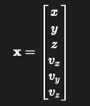
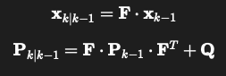
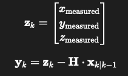
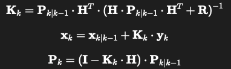

# ArUco Marker Tracking with Kalman Filter

This project demonstrates robust ArUco marker tracking using a Kalman Filter for smoothing and prediction. It combines computer vision with basic filtering techniques to reduce noise in marker pose estimation over time.

## Features

- Detect ArUco markers using OpenCV
- Estimate pose of each marker relative to the camera
- Apply Kalman Filter to smooth out translation and/or rotation
- Visualize raw vs. filtered positions in real time

## Project Objective

The goal of this project is to:

- Detect ArUco markers in a camera stream
- Estimate their pose (translation and rotation) relative to the camera
- Apply a Kalman Filter to smooth the marker’s position
- Visualize and optionally log both raw and filtered pose data

## Technologies Used

- Python 3.9+
- OpenCV (including ArUco module)
- Kalman Filter 


## Kalman Filter Model

We use a **constant-velocity 3D motion model**:

### State Vector:

<p align="center">
    
</p>

### Prediction Equation:

<p align="center">
    
</p>

Where:
- 𝐅 : State transition matrix (uses `dt`)
- 𝐐 : Process noise covariance (based on acceleration noise)

### Measurement Model:

<p align="center">
    
</p>


Where:
- 𝐇 : Measurement matrix (extracts position from state)
- 𝐑 : Measurement noise covariance

### Kalman Gain & Update:

<p align="center">
    
</p>

---

## Parameters Explained

| Variable | Role | Typical Value |
|----------|------|----------------|
| `dt` | Time between frames | ~1/20.0 |
| `ACCEL_STD` | Standard deviation of acceleration (process noise) | 3.0–7.0 |
| `MEAS_STD` | Standard deviation of position measurement (camera noise) | 0.1–0.5 |
| `CONFIRM_THRESHOLD` | Minimum detections to confirm a marker | 2–3 |

---

## Getting Started

### 1. Clone the repository

```bash
git clone https://github.com/SUNTADTAWAN/MiniCarver.git
cd aruco-kalman-tracker
```

### 2. Activate the environment
``` bash 
source aruco_env/bin/activate
```

### 3. Install dependencies 

If not already installed :

``` bash
pip install -r requirements.txt
```

### 4. Run the script
``` bash
python scripts/aruco_kalman_tracker.py
```

## Example Output

## Author
Tadtawan Chaloempornmongkol

